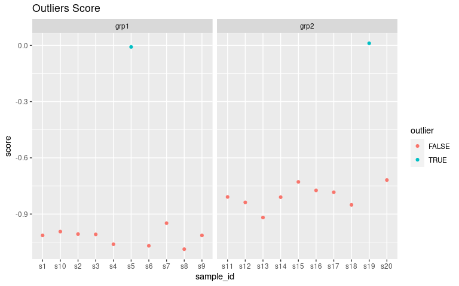

# Visualization Quality Control

A set of useful functions for calculating various measures from
high-feature datasets and visualizing them.

In addition to internal documentation, the package is also documented
heavily
[here](https://moseleybioinformaticslab.github.io/visualizationQualityControl/).

This package combines my needs for visualizing sample-sample
correlations using heatmaps, and novel quality control measures that
apply to different types of -omics or high-feature datasets proposed by
[Gierlinski et al.,
2015](https://dx.doi.org/10.1093/bioinformatics/btv425), namely the
`median_correlation` and `outlier_fraction` functions.

## Installation

### Dependencies

-   `ComplexHeatmap`, for generating the heatmaps.
-   `dendsort`, for reordering samples in heatmaps.
-   `ICIKendallTau`, for calculating Kendall-tau with missing values.

These should get installed automatically.

### This Package

This package can be installed using the `remotes` package:

    remotes::install_github("moseleybioinformaticslab/visualizationQualityControl")

## Examples

These examples show the primary functionality. We will apply the
visualizations to a two group dataset. However, all of the functions are
still applicable to datasets with more than two groups. The examples
below are for a dataset where there has been a sample swapped between
the two groups (i.e. there is a problem!). If you want to see how the
visualizations compare between a **good** dataset and a **bad** dataset,
see the **quality\_control** vignette.

    library(visualizationQualityControl)
    library(ggplot2)
    library(ggforce)
    data("grp_cor_data")
    exp_data = grp_cor_data$data
    rownames(exp_data) = paste0("f", seq(1, nrow(exp_data)))
    colnames(exp_data) = paste0("s", seq(1, ncol(exp_data)))

    sample_info = data.frame(id = colnames(exp_data), class = grp_cor_data$class)

    exp_data[, 5] = grp_cor_data$data[, 19]
    exp_data[, 19] = grp_cor_data$data[, 5]
    sample_classes = sample_info$class

### Visualize PCA Component Scores

    pca_data = prcomp(t(exp_data), center = TRUE)
    pca_scores = as.data.frame(pca_data$x)
    pca_scores = cbind(pca_scores, sample_info)
    ggplot(pca_scores, aes(x = PC1, y = PC2, color = class)) + geom_point()

To see how much explained variance each PC has, you can calculate them:

    knitr::kable(visqc_score_contributions(pca_data$x))

<table>
<colgroup>
<col style="width: 6%" />
<col style="width: 6%" />
<col style="width: 12%" />
<col style="width: 12%" />
<col style="width: 13%" />
<col style="width: 50%" />
</colgroup>
<thead>
<tr class="header">
<th style="text-align: left;"></th>
<th style="text-align: left;">pc</th>
<th style="text-align: right;">variance</th>
<th style="text-align: right;">percent</th>
<th style="text-align: right;">cumulative</th>
<th style="text-align: left;">labels</th>
</tr>
</thead>
<tbody>
<tr class="odd">
<td style="text-align: left;">PC1</td>
<td style="text-align: left;">PC1</td>
<td style="text-align: right;">2.0852320</td>
<td style="text-align: right;">0.6853218</td>
<td style="text-align: right;">0.6853218</td>
<td style="text-align: left;">PC1 (69%)</td>
</tr>
<tr class="even">
<td style="text-align: left;">PC2</td>
<td style="text-align: left;">PC2</td>
<td style="text-align: right;">0.0944324</td>
<td style="text-align: right;">0.0310357</td>
<td style="text-align: right;">0.7163574</td>
<td style="text-align: left;">PC2 (3.1%)</td>
</tr>
<tr class="odd">
<td style="text-align: left;">PC3</td>
<td style="text-align: left;">PC3</td>
<td style="text-align: right;">0.0827594</td>
<td style="text-align: right;">0.0271993</td>
<td style="text-align: right;">0.7435567</td>
<td style="text-align: left;">PC3 (2.7%)</td>
</tr>
<tr class="even">
<td style="text-align: left;">PC4</td>
<td style="text-align: left;">PC4</td>
<td style="text-align: right;">0.0802501</td>
<td style="text-align: right;">0.0263746</td>
<td style="text-align: right;">0.7699313</td>
<td style="text-align: left;">PC4 (2.6%)</td>
</tr>
<tr class="odd">
<td style="text-align: left;">PC5</td>
<td style="text-align: left;">PC5</td>
<td style="text-align: right;">0.0758842</td>
<td style="text-align: right;">0.0249397</td>
<td style="text-align: right;">0.7948710</td>
<td style="text-align: left;">PC5 (2.5%)</td>
</tr>
<tr class="even">
<td style="text-align: left;">PC6</td>
<td style="text-align: left;">PC6</td>
<td style="text-align: right;">0.0750434</td>
<td style="text-align: right;">0.0246634</td>
<td style="text-align: right;">0.8195344</td>
<td style="text-align: left;">PC6 (2.5%)</td>
</tr>
<tr class="odd">
<td style="text-align: left;">PC7</td>
<td style="text-align: left;">PC7</td>
<td style="text-align: right;">0.0668954</td>
<td style="text-align: right;">0.0219855</td>
<td style="text-align: right;">0.8415199</td>
<td style="text-align: left;">PC7 (2.2%)</td>
</tr>
<tr class="even">
<td style="text-align: left;">PC8</td>
<td style="text-align: left;">PC8</td>
<td style="text-align: right;">0.0600538</td>
<td style="text-align: right;">0.0197370</td>
<td style="text-align: right;">0.8612569</td>
<td style="text-align: left;">PC8 (2%)</td>
</tr>
<tr class="odd">
<td style="text-align: left;">PC9</td>
<td style="text-align: left;">PC9</td>
<td style="text-align: right;">0.0590223</td>
<td style="text-align: right;">0.0193980</td>
<td style="text-align: right;">0.8806548</td>
<td style="text-align: left;">PC9 (1.9%)</td>
</tr>
<tr class="even">
<td style="text-align: left;">PC10</td>
<td style="text-align: left;">PC10</td>
<td style="text-align: right;">0.0520022</td>
<td style="text-align: right;">0.0170908</td>
<td style="text-align: right;">0.8977456</td>
<td style="text-align: left;">PC10 (1.7%)</td>
</tr>
<tr class="odd">
<td style="text-align: left;">PC11</td>
<td style="text-align: left;">PC11</td>
<td style="text-align: right;">0.0507126</td>
<td style="text-align: right;">0.0166670</td>
<td style="text-align: right;">0.9144126</td>
<td style="text-align: left;">PC11 (1.7%)</td>
</tr>
<tr class="even">
<td style="text-align: left;">PC12</td>
<td style="text-align: left;">PC12</td>
<td style="text-align: right;">0.0450374</td>
<td style="text-align: right;">0.0148018</td>
<td style="text-align: right;">0.9292143</td>
<td style="text-align: left;">PC12 (1.5%)</td>
</tr>
<tr class="odd">
<td style="text-align: left;">PC13</td>
<td style="text-align: left;">PC13</td>
<td style="text-align: right;">0.0398570</td>
<td style="text-align: right;">0.0130992</td>
<td style="text-align: right;">0.9423135</td>
<td style="text-align: left;">PC13 (1.3%)</td>
</tr>
<tr class="even">
<td style="text-align: left;">PC14</td>
<td style="text-align: left;">PC14</td>
<td style="text-align: right;">0.0380927</td>
<td style="text-align: right;">0.0125194</td>
<td style="text-align: right;">0.9548329</td>
<td style="text-align: left;">PC14 (1.3%)</td>
</tr>
<tr class="odd">
<td style="text-align: left;">PC15</td>
<td style="text-align: left;">PC15</td>
<td style="text-align: right;">0.0337662</td>
<td style="text-align: right;">0.0110974</td>
<td style="text-align: right;">0.9659303</td>
<td style="text-align: left;">PC15 (1.1%)</td>
</tr>
<tr class="even">
<td style="text-align: left;">PC16</td>
<td style="text-align: left;">PC16</td>
<td style="text-align: right;">0.0304897</td>
<td style="text-align: right;">0.0100206</td>
<td style="text-align: right;">0.9759509</td>
<td style="text-align: left;">PC16 (1%)</td>
</tr>
<tr class="odd">
<td style="text-align: left;">PC17</td>
<td style="text-align: left;">PC17</td>
<td style="text-align: right;">0.0271052</td>
<td style="text-align: right;">0.0089083</td>
<td style="text-align: right;">0.9848592</td>
<td style="text-align: left;">PC17 (0.89%)</td>
</tr>
<tr class="even">
<td style="text-align: left;">PC18</td>
<td style="text-align: left;">PC18</td>
<td style="text-align: right;">0.0252369</td>
<td style="text-align: right;">0.0082942</td>
<td style="text-align: right;">0.9931534</td>
<td style="text-align: left;">PC18 (0.83%)</td>
</tr>
<tr class="odd">
<td style="text-align: left;">PC19</td>
<td style="text-align: left;">PC19</td>
<td style="text-align: right;">0.0208322</td>
<td style="text-align: right;">0.0068466</td>
<td style="text-align: right;">1.0000000</td>
<td style="text-align: left;">PC19 (0.68%)</td>
</tr>
<tr class="even">
<td style="text-align: left;">PC20</td>
<td style="text-align: left;">PC20</td>
<td style="text-align: right;">0.0000000</td>
<td style="text-align: right;">0.0000000</td>
<td style="text-align: right;">1.0000000</td>
<td style="text-align: left;">PC20 (0.0000000000000000000000000000029%)</td>
</tr>
</tbody>
</table>

### visqc\_heatmap

Calculate sample-sample correlations and reorder based on within class
correlations. We recommend a transform agnostic correlation like
Kendall-tau that can also handle missing data when necessary. Here we
use the {ici\_kendalltau} function from our
[ICIKendallTau](https://moseleybioinformaticslab.github.io/ICIKendallTau/)
package.

    rownames(sample_info) = sample_info$sample
    data_cor = ICIKendallTau::ici_kendalltau(t(exp_data))
    data_order = similarity_reorderbyclass(data_cor$cor, sample_info[, "class", drop = FALSE], transform = "sub_1")

And then generate a colormapping for the sample classes and plot the
correlation heatmap.

    data_legend = generate_group_colors(2)
    names(data_legend) = c("grp1", "grp2")
    row_data = sample_info[, "class", drop = FALSE]
    row_annotation = list(class = data_legend)

    library(viridis)
    library(circlize)
    colormap = colorRamp2(seq(0.3, 1, length.out = 50), viridis::viridis(50))

    visqc_heatmap(data_cor$cor, colormap, "Correlation", row_color_data = row_data,
                  row_color_list = row_annotation, col_color_data = row_data,
                  col_color_list = row_annotation, row_order = data_order$indices,
                  column_order = data_order$indices)

### median\_correlations

    data_medcor = median_correlations(data_cor$cor, sample_info$class)
    ggplot(data_medcor, aes(x = sample_id, y = med_cor)) + geom_point() + 
      facet_grid(. ~ sample_class, scales = "free_x") + ggtitle("Median Correlation")

    ggplot(data_medcor, aes(x = sample_class, y = med_cor)) +
      geom_sina() +
      ggtitle("Median Correlation")

### outlier\_fraction

    data_outlier = outlier_fraction(t(exp_data), sample_info$class)
    ggplot(data_outlier, aes(x = sample_id, y = frac)) + geom_point() + 
      facet_grid(. ~ sample_class, scales = "free_x") + ggtitle("Outlier Fraction")

    ggplot(data_outlier, aes(x = sample_class, y = frac)) +
      geom_sina() +
      ggtitle("Outlier Fraction")

### determine\_outliers

We can combine the median correlations and outlier fractions into a
single score and then examine the distribution of scores to look for
outliers.

    out_samples = determine_outliers(data_medcor, data_outlier)

    ggplot(out_samples, aes(x = sample_id, y = score, color = outlier)) +
      geom_point() +
      facet_wrap(~ sample_class, scales = "free_x") +
      ggtitle("Outliers Score")

    ggplot(out_samples, aes(x = sample_class, y = score, color = outlier, group = sample_class)) +
      geom_sina() +
      ggtitle("Outliers Score")

Here we can see the outliers by their combined score. **However**, in
this case we don’t actually want to remove the samples. In this example,
what actually happened was that two samples got their `sample_class`
wrong. And we can see that by going back to the **correlation heatmap**,
that this is the case by the high correlation values observed with the
other class of samples.

### Correlation that Includes Missing Values

When there are missing values (either NA, or 0 depending on the case),
we can use the information-content-informed Kendall-tau. This works
under the assumption that **most** missing data in -omics is because
samples have values that fall below the detection limit. Because of
this, missingness actually contributes **some** information that can be
incorporated in the correlation. The package
[ICIKendallTau](https://moseleybioinformaticslab.github.io/ICIKendallTau/)
provides this correlation measure.

Lets add some missingness to our data.

    exp_data = grp_cor_data$data
    rownames(exp_data) = paste0("f", seq(1, nrow(exp_data)))
    colnames(exp_data) = paste0("s", seq(1, ncol(exp_data)))

    make_na = rep(FALSE, nrow(exp_data))
    s1_missing = make_na
    s1_missing[sample(length(make_na), 20)] = TRUE
    s2_missing = make_na
    s2_missing[sample(which(!s1_missing), 20)] = TRUE

    exp_data2 = exp_data
    exp_data2[s1_missing, 1] = NA
    exp_data2[s2_missing, 1] = NA

    cor_random_missing = ICIKendallTau::ici_kendalltau(t(exp_data2))$cor
    cor_random_missing[1:4, 1:4]

    ##           s1        s2        s3        s4
    ## s1 0.6000000 0.2447565 0.2733701 0.3015435
    ## s2 0.2447565 1.0000000 0.7058586 0.7200000
    ## s3 0.2733701 0.7058586 1.0000000 0.6925253
    ## s4 0.3015435 0.7200000 0.6925253 1.0000000

    cor_random_missing_nw = ICIKendallTau::ici_kendalltau(t(exp_data))$cor
    cor_random_missing_nw[1:4, 1:4]

    ##           s1        s2        s3        s4
    ## s1 1.0000000 0.6953535 0.7074747 0.7224242
    ## s2 0.6953535 1.0000000 0.7058586 0.7200000
    ## s3 0.7074747 0.7058586 1.0000000 0.6925253
    ## s4 0.7224242 0.7200000 0.6925253 1.0000000

What happens if we make the missingness match between them? That counts
as information? If the feature is missing in the same samples, that is
worth something?

    exp_data = grp_cor_data$data
    rownames(exp_data) = paste0("f", seq(1, nrow(exp_data)))
    colnames(exp_data) = paste0("s", seq(1, ncol(exp_data)))
    exp_data[s1_missing, 1:2] = NA

    cor_same_missing = ICIKendallTau::ici_kendalltau(t(exp_data))$cor
    cor_same_missing[1:4, 1:4]

    ##           s1        s2        s3        s4
    ## s1 0.8000000 0.7794118 0.4643526 0.4717690
    ## s2 0.7794118 0.8000000 0.4631165 0.4771253
    ## s3 0.4643526 0.4631165 1.0000000 0.6925253
    ## s4 0.4717690 0.4771253 0.6925253 1.0000000

Here we can see that the correlation between sapmles S1 and S2 has
actually increased over the random missing case.

## Fake Data Generation

Some fake data is stored in `grp_cor_data` that is useful for testing
the `median_correlation` function. It was generated by:

    library(fakeDataWithError)
    set.seed(1234)

    s1 = runif(100, 0, 1)
    grp1 = add_uniform_noise(10, s1, 0.1)

    model_data = data.frame(s1 = s1, s2 = grp1[, 1])

    lm_1 = lm(s1 ~ s2, data = model_data)

    lm_1$coefficients[2] = 0.5

    s3 = predict(lm_1)
    s4 = add_uniform_noise(1, s3, 0.2)

    grp2 = add_uniform_noise(10, s4, 0.1)

    grp_class = rep(c("grp1", "grp2"), each = 10)

    grp_cor_data = list(data = cbind(grp1, grp2), class = grp_class)

    library(fakeDataWithError)
    set.seed(1234)

    n_point = 1000
    n_rep = 10

    # a nice log-normal distribution of points with points along the entire range
    simulated_data = c(rlnorm(n_point / 2, meanlog = 1, sdlog = 1),
                        runif(n_point / 2, 5, 100))

    # go to log to have decent correlations on the "transformed" data
    lsim1 = log(simulated_data)

    # add some uniform noise to get lower than 1 correlations
    lgrp1 = add_uniform_noise(n_rep, lsim1, .5)

    # add some uniform noise to everything in normal space
    sim1_error = add_uniform_noise(n_rep, simulated_data, 1, use_zero = TRUE)
    # and generate the grp1 data in normal space
    ngrp1 = exp(lgrp1) + sim1_error

    # do regression to generate some other data
    model_data = data.frame(lsim1 = lsim1, lsim2 = lgrp1[, 1])
    lm_1 = lm(lsim1 ~ lsim2, data = model_data)

    # reduce the correlation between them
    lm_1$coefficients[2] = 0.5
    lsim3 = predict(lm_1)

    # and a bunch of error
    lsim4 = add_uniform_noise(1, lsim3, 1.5)

    # create group with added error to reduce correlation from 1
    lgrp2 = add_uniform_noise(10, lsim4, .5)

    # add error in original space
    nsim4 = exp(lsim4)
    sim4_error = add_uniform_noise(10, nsim4, 1, use_zero = TRUE)
    ngrp2 = exp(lgrp2) + sim4_error

    # put all data together, and make negatives zero
    all_data = cbind(ngrp1, ngrp2)
    all_data[(all_data < 0)] = 0

    grp_class = rep(c("grp1", "grp2"), each = 10)

    grp_exp_data = list(data = all_data, class = grp_class)
